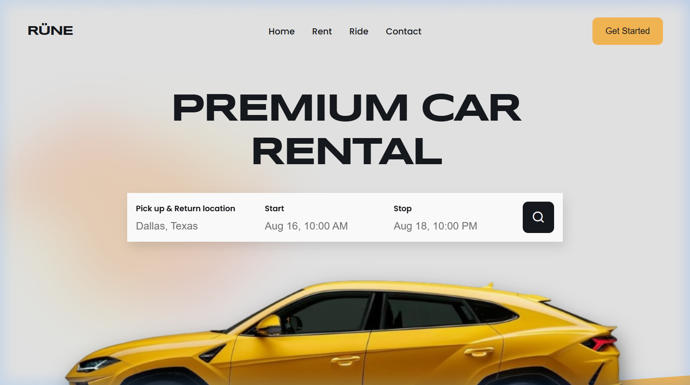
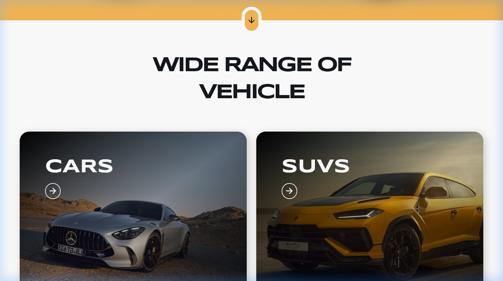
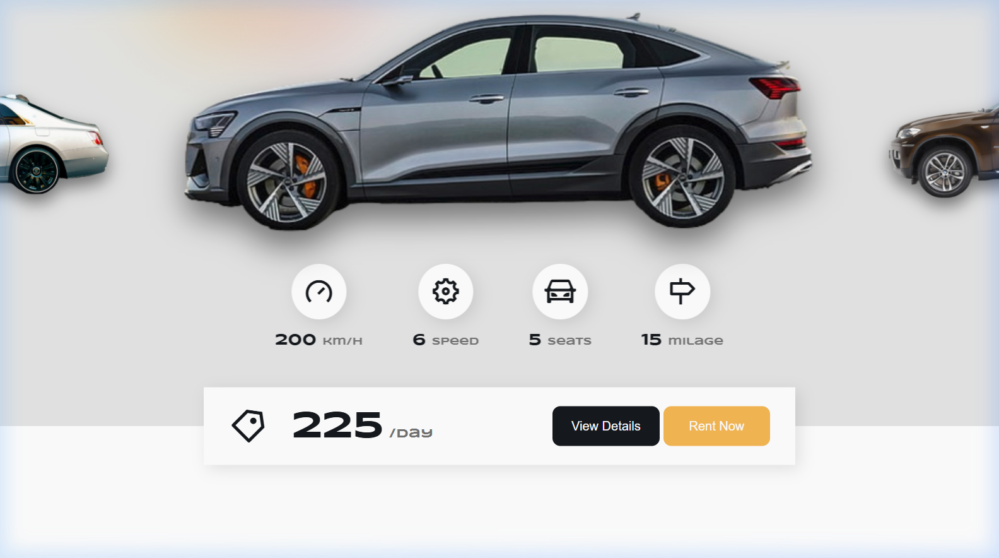
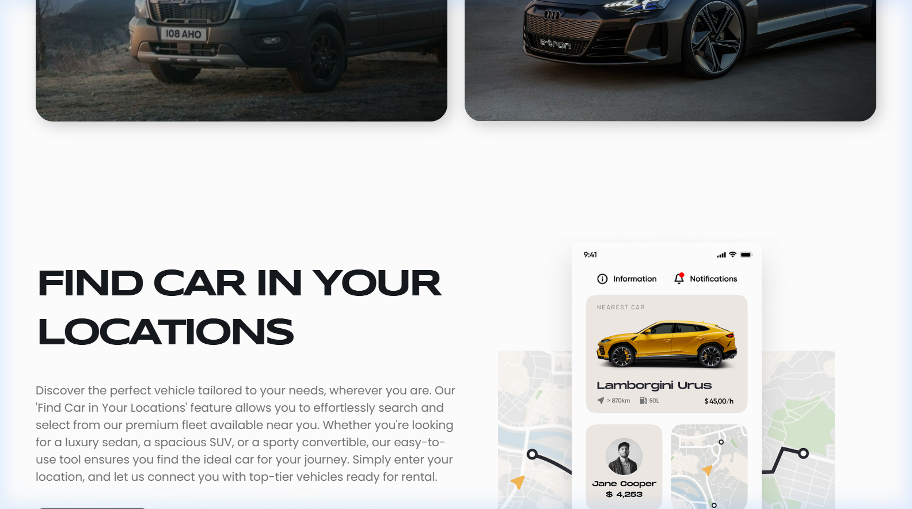
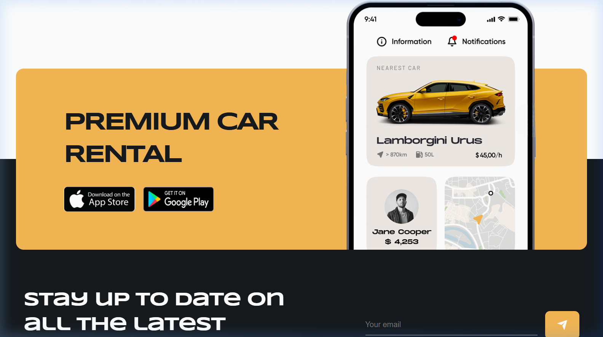

<div align="center">

<br/>

# 🚗 RÜNE — Premium Car Rental

**A sleek, high-performance landing page for a premium car rental experience.**

[](https://developer.mozilla.org/en-US/docs/Web/HTML)
[](https://developer.mozilla.org/en-US/docs/Web/CSS)
[](https://developer.mozilla.org/en-US/docs/Web/JavaScript)
[](https://swiperjs.com/)

</div>

---

## ✨ Overview

**Rüne** is a modern, responsive landing page designed for a premium car rental service. Built entirely with vanilla HTML, CSS, and JavaScript, it delivers a polished visual experience with smooth animations, an interactive vehicle carousel, and an auto-scrolling brand banner — all without a single framework dependency.

---

## 📸 Preview

<table>
  <tr>
    <td align="center" colspan="2">
      <strong>🏠 Hero — Premium Car Rental</strong><br/>
      
    </td>
  </tr>
  <tr>
    <td align="center" width="50%">
      <strong>🚗 Wide Range of Vehicle</strong><br/>
      
    </td>
    <td align="center" width="50%">
      <strong>🎡 Pick Your Dream Car</strong><br/>
      
    </td>
  </tr>
  <tr>
    <td align="center" width="50%">
      <strong>🎠 3D Car Carousel</strong><br/>
      
    </td>
    <td align="center" width="50%">
      <strong>📲 Download & Footer</strong><br/>
      
    </td>
  </tr>
</table>

---

## 🖼️ Sections

| Section | Description |
|---|---|
| **Hero / Home** | Full-screen header with a search form (location, start & stop dates) |
| **Range** | Grid showcase of vehicle categories: Cars, SUVs, Vans & Electric |
| **Find Location** | Split-layout section with location imagery and CTA |
| **Pick Your Car** | Interactive Swiper carousel with live price updates per vehicle |
| **Stories** | Blog-style cards with travel narratives and dates |
| **Brand Banner** | Auto-scrolling, looping partner/brand logo strip |
| **Download** | App store links section with device mockup |
| **Newsletter** | Email subscription form for news and updates |
| **Footer** | Navigation links, social media icons, and copyright |

---

## 🛠️ Tech Stack

| Technology | Purpose |
|---|---|
| **HTML5** | Semantic page structure |
| **CSS3** | Custom styling, animations, and responsive layout |
| **Vanilla JavaScript** | DOM manipulation, interactivity, and scroll behavior |
| **[Swiper.js v11](https://swiperjs.com/)** | 3D Coverflow vehicle carousel |
| **[ScrollReveal](https://scrollrevealjs.org/)** | Scroll-triggered entrance animations |
| **[Remix Icons v4](https://remixicon.com/)** | Icon library used throughout the UI |

---

## 🗂️ Project Structure

```
Rune-Rental-Car/
│
├── index.html          # Main HTML — all sections and layout
├── style.css           # Global styles, animations, responsive design
├── main.js             # Interactivity: menu toggle, Swiper, ScrollReveal, banner
│
├── assets/             # Images used across sections
│   ├── header.png
│   ├── location.png
│   ├── select-1.png → select-5.png
│   ├── range-1.jpg  → range-4.jpg
│   ├── story-1.jpg  → story-3.jpg
│   ├── banner-1.png → banner-10.png
│   ├── download.png
│   ├── apple.png
│   └── google.png
│
└── logo/
    └── rünelogo.png    # Favicon and brand logo
```

---

## ⚙️ Features

- 📱 **Fully Responsive** — adapts to mobile, tablet, and desktop viewports
- 🎡 **3D Vehicle Carousel** — Swiper.js with Coverflow effect and dynamic price display
- 🎬 **Scroll Animations** — staggered entrance effects via ScrollReveal
- 🔁 **Auto-Scrolling Banner** — infinite looping banner strip via CSS animation and DOM cloning
- ☰ **Mobile Navigation** — hamburger menu with animated icon toggle
- 📰 **Newsletter Form** — email subscription with a clean, minimal input UI

---

## 🚀 Getting Started

No build tools or package installation required. Just open the project in a browser.

### Option 1 — Open directly

```bash
# Clone the repository
git clone https://github.com/ramirolacci/Rune-Rental-Car.git

# Navigate to the project folder
cd Rune-Rental-Car

# Open index.html in your browser
start index.html    # Windows
open index.html     # macOS
xdg-open index.html # Linux
```

### Option 2 — Live Server (recommended for development)

If you use **VS Code**, install the [Live Server](https://marketplace.visualstudio.com/items?itemName=ritwickdey.LiveServer) extension and click **"Go Live"** from `index.html`.

---

## 🎨 Design Highlights

- **Dark-themed** aesthetic with high-contrast typography for a premium feel
- **Coverflow 3D effect** on the car selection slider for an immersive browsing experience
- **Staggered animations** on section entry to guide user attention naturally
- **Smooth scroll** and anchor-based navigation between sections
- Clean, **BEM-inspired CSS class naming** for maintainability

---

## 📄 License

© 2024 **Ramiro Lacci**. All rights reserved.

---

<div align="center">

Made with ❤️ by [Ramiro Lacci](https://github.com/ramirolacci)

</div>
