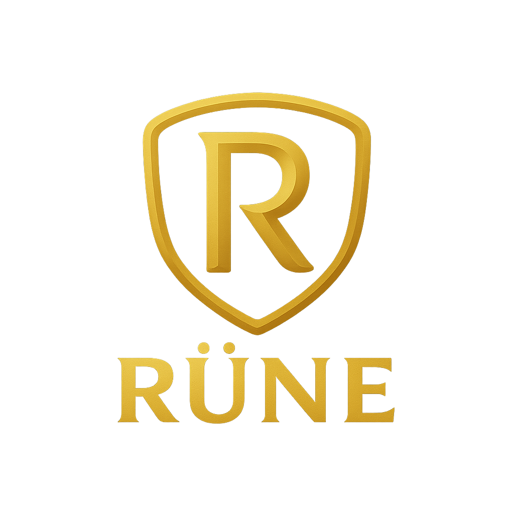
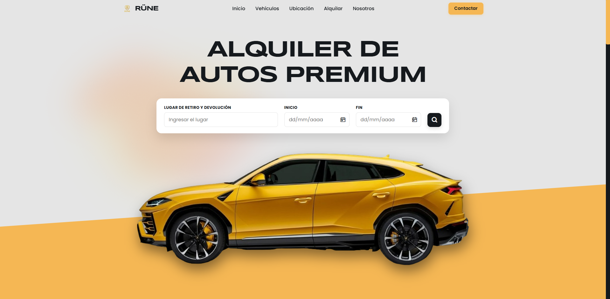
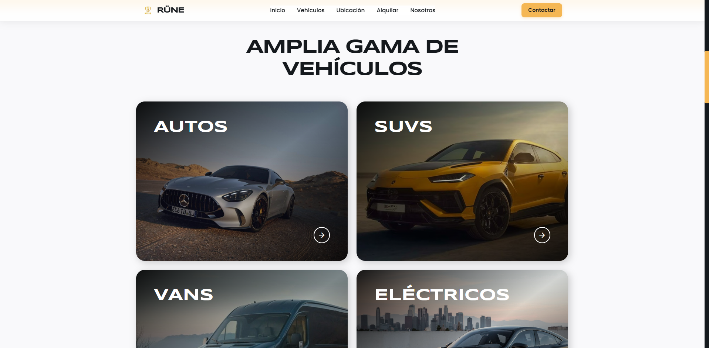
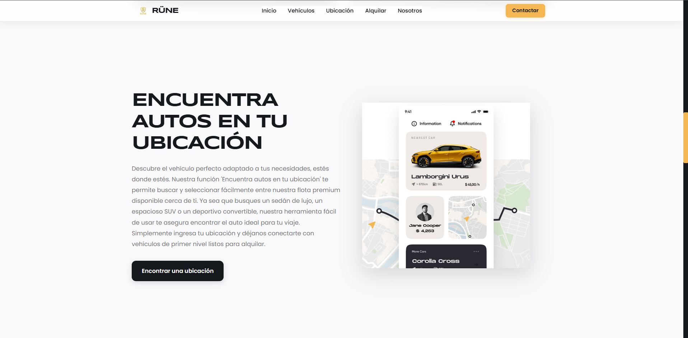
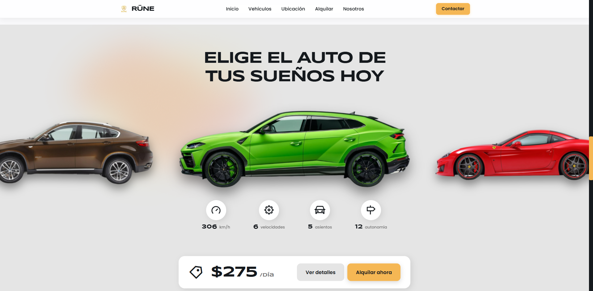
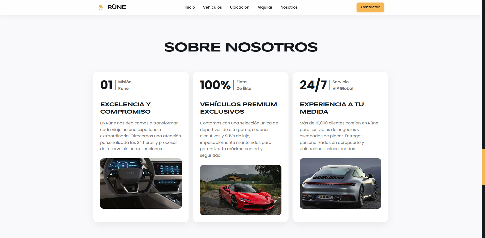
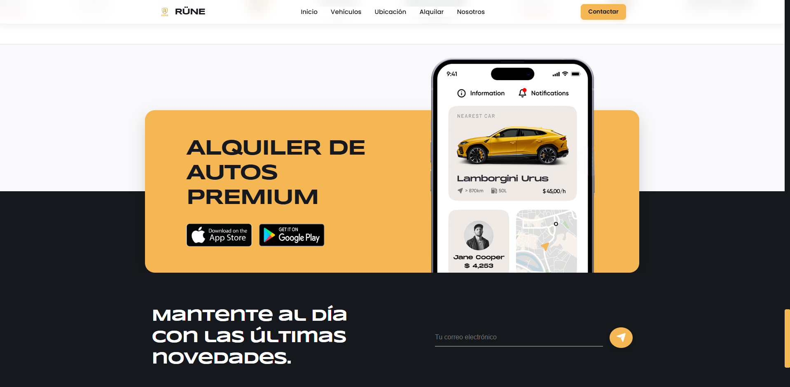

<div align="center">



<br/>

# 🚗 RÜNE — Premium Car Rental

**Plataforma web moderna y de alto rendimiento para alquiler de vehículos premium.**

[](https://reactjs.org/)
[](https://vitejs.dev/)
[](https://developer.mozilla.org/en-US/docs/Web/JavaScript)
[](https://developer.mozilla.org/en-US/docs/Web/CSS)
[](https://www.framer.com/motion/)
[](https://swiperjs.com/)
[](https://pnpm.io/)

</div>

---

## ✨ Descripción General

**Rüne Rental Car** es una aplicación web SPA (*Single Page Application*) desarrollada en **React** y **Vite**. Diseñada con una estética moderna, elegante y de nivel premium, ofrece una experiencia interactiva y fluida para el alquiler de autos de lujo. 

Incluye navegación con desenfoque al desplazarse (*glassmorphism blur navbar*), selector de fechas estilizado en línea, carrusel 3D de vehículos con reproducción automática y transiciones suaves, secciones dedicadas a la agencia y botón de contacto directo a WhatsApp.

---

## 📸 Galería de Capturas

<table>
  <tr>
    <td align="center" width="50%">
      <strong>🏠 Inicio — Alquiler de Autos Premium</strong><br/>
      
    </td>
    <td align="center" width="50%">
      <strong>🚗 Amplia Gama de Vehículos</strong><br/>
      
    </td>
  </tr>
  <tr>
    <td align="center" width="50%">
      <strong>📍 Ubicación en Pantalla Completa</strong><br/>
      
    </td>
    <td align="center" width="50%">
      <strong>🎡 Elige el Auto de tus Sueños (Autoplay 3D)</strong><br/>
      
    </td>
  </tr>
  <tr>
    <td align="center" width="50%">
      <strong>👥 Sobre Nosotros & Experiencia VIP</strong><br/>
      
    </td>
    <td align="center" width="50%">
      <strong>📲 Aplicación Móvil, Boletín & Pie de Página</strong><br/>
      
    </td>
  </tr>
</table>

---

## 🖼️ Secciones de la Aplicación

| Sección | Descripción |
|---|---|
| **Inicio (`#home`)** | Cabecera principal con diseño diagonal característico, formulario de búsqueda (Lugar de retiro/devolución y fechas de Inicio/Fin con selector de calendario estilizado). |
| **Vehículos (`#about`)** | Tarjetas de categorías: Autos, SUVs, Vans y Eléctricos. |
| **Ubicación (`#rent`)** | Sección dedicada en pantalla completa con presentación de búsqueda por proximidad. |
| **Alquilar (`#ride`)** | Carrusel interactivo 3D Swiper en Coverflow con transición automática suave, especificaciones y modal de reserva. |
| **Sobre Nosotros (`#contact`)** | Información institucional de la agencia Rüne: Misión, Flota de élite y Servicio VIP. |
| **Marcas & App** | Marquesina con desplazamiento infinito de logotipos aliados y sección de descarga de app móvil. |
| **Contacto & Footer** | Enlace directo a WhatsApp en navbar, suscripción a boletín y enlaces institucionales. |

---

## 🛠️ Tecnologías Utilizadas

| Tecnología | Propósito |
|---|---|
| **[React 18](https://reactjs.org/)** | Arquitectura basada en componentes reutilizables |
| **[Vite](https://vitejs.dev/)** | Bundler rápido y entorno de desarrollo con HMR |
| **[Framer Motion](https://www.framer.com/motion/)** | Animaciones de entrada y transiciones de componentes |
| **[Swiper.js v11](https://swiperjs.com/)** | Carrusel 3D Coverflow con Autoplay para vehículos |
| **[Remix Icon v4](https://remixicon.com/)** | Conjunto completo de íconos vectoriales UI y redes sociales (incluyendo X) |
| **[pnpm](https://pnpm.io/)** | Gestor de paquetes rápido y eficiente |

---

## ⚙️ Características Principales

- 📱 **Diseño 100% Responsivo** — Optimizado para pantallas móviles, tablets y escritorio.
- 🎨 **Estética Premium** — Tonos oscuros combinados con acentos amarillos vibrantes e imágenes en alta resolución.
- 📅 **Calendario Personalizado Popover** — Selector de fechas estilizado en español para Inicio y Fin de alquiler.
- 💬 **Integración Directa a WhatsApp** — Botón *"Contactar"* en la barra de navegación para comunicación instantánea.
- 🔄 **Transición Suave & Autoplay** — Carrusel de vehículos con rotación continua y pausa en *hover*.
- 📍 **Desplazamiento Suave e Independiente** — Alineación óptima por sección sin solapamientos visuales.

---

## 🚀 Instalación y Ejecución Local

1. **Clonar el repositorio:**
   ```bash
   git clone https://github.com/ramirolacci/Rune-Rental-Car.git
   cd Rune-Rental-Car
   ```

2. **Instalar dependencias con pnpm:**
   ```bash
   pnpm install
   ```

3. **Iniciar el servidor de desarrollo:**
   ```bash
   pnpm run dev
   ```

4. **Construir para producción:**
   ```bash
   pnpm run build
   ```

---

## 📄 Licencia y Créditos

Rüne © 2026 Todos los derechos reservados | Desarrollado por [**WaveFrame Studio**](https://waveframe.com.ar/)

---

<div align="center">

Hecho con ❤️ por [Ramiro Lacci](https://github.com/ramirolacci) y [WaveFrame Studio](https://waveframe.com.ar/)

</div>
